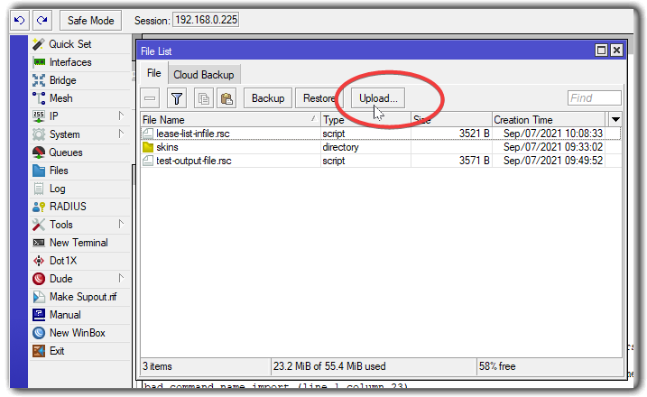
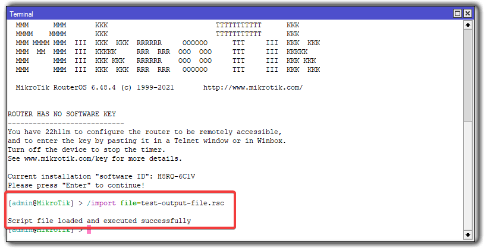
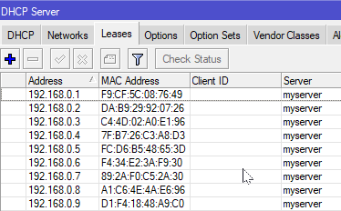

# OpenWRT DHCP Leases to MikroTik

This is a Python script to convert OpenWRT DHCP leases to MikroTik format. This tool is handy when you are migrating from OpenWRT to MikroTik and want to preserve your DHCP leases.

## Prerequisites

* Access to OpenWRT router via terminal or ssh.
* Access to MikroTik to import the converted leases.
* Python 3

## Usage

1. Run the script `openwrt-dhcp-leases-to-mikrotik.py` with required arguments:

    ```
    python openwrt-dhcp-leases-to-mikrotik.py input_file output_file -s server_name --skip_dupe_check
    ```

    - `input_file`: The OpenWRT configuration file to parse.
    - `output_file`: The output file where to write the results.
    - `-s or --server_name`: The server name to be written in the output file. Default is 'dhcp1'.
    - `--skip_dupe_check`: If provided, the duplicate check will be skipped.

2. Copy your OpenWRT DHCP leases file (`/etc/config/dhcp`) to your local computer:

    ```
    scp root@<openwrt_router_ip>:/etc/config/dhcp ./openwrt-dhcp-leases
    ```

    Replace `<openwrt_router_ip>` with the IP address of your OpenWRT router.

3. Run the Python script:

    ```
    python openwrt-dhcp-leases-to-mikrotik.py openwrt-dhcp-leases dhcp-static-leases.rsc --server_name dhcp1
    ```

## MikroTik - Import

1. Open [Winbox](https://mikrotik.com/download) or the [Webfig](https://help.mikrotik.com/docs/display/ROS/Webfig) URL.

2. Select `Files` from the menu and upload your input file (or just drag and drop your file if using Winbox).

      

3. Open `New Terminal` from the menu in Winbox, or in Webfig click on the `Terminal` button on the top.

4. Execute the following, changing the name of the input file as needed:

    ````bash
    /import file=dhcp-static-leases.rsc
    ````

5. The terminal should respond "Script file loaded and executed successfully".

    

6. Common Error Messages:

    * **"Already have a static lease for this client"** - Edit the input file to delete the lease or merge them somehow.
    * **"input does not match any value of server"** - Most likely the DHCP server named in your input file is different from your Mikrotik RouterOS configuration. Either change the name of the DHCP Server (in Winbox, IP->DHCP Server->DHCP  and click on server), edit the input file or use the `--server_name` argument. 

7. Verify all leases are imported by navigating to IP->DHCP Server and clicking the `Leases` tab.

    

    Or, alternatively, by using the terminal:
  
      ````bash
      /ip dhcp-server lease print
      ````

## Notes

This script was inspired by [uproot](https://github.com/GeekVisit/uproot). Uproot is a more feature-rich tool for converting router configurations.

## Credits 

The import to Mikrotik section in this README was taken from uproot.